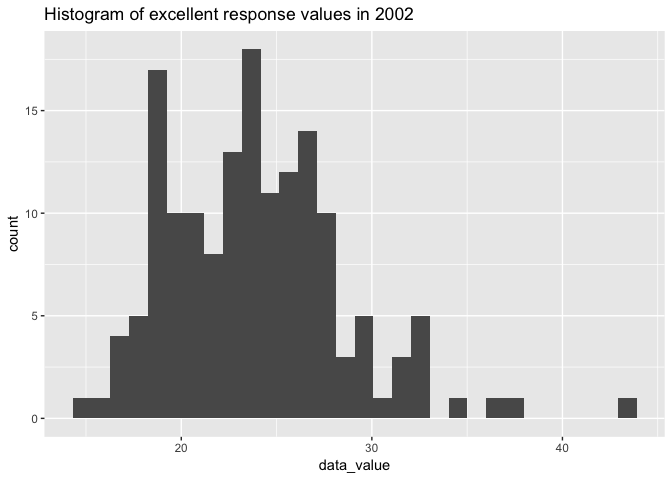
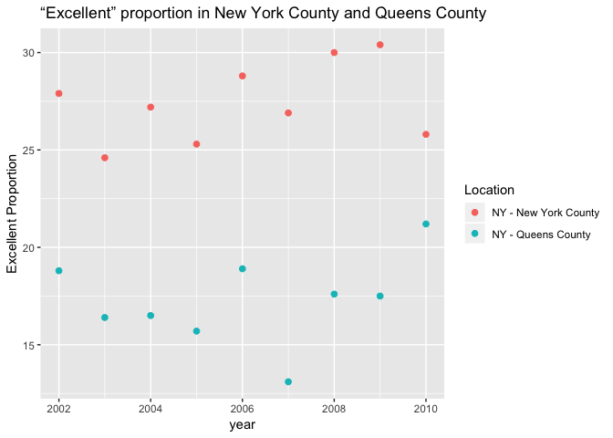

P8105\_hw\_yx2510
================
Yi Xiao
28/09/2018

load package

``` r
library(tidyverse)
```

    ## ── Attaching packages ────────────────────────────────────────────────────────────────────── tidyverse 1.2.1 ──

    ## ✔ ggplot2 3.0.0     ✔ purrr   0.2.5
    ## ✔ tibble  1.4.2     ✔ dplyr   0.7.6
    ## ✔ tidyr   0.8.1     ✔ stringr 1.3.1
    ## ✔ readr   1.1.1     ✔ forcats 0.3.0

    ## ── Conflicts ───────────────────────────────────────────────────────────────────────── tidyverse_conflicts() ──
    ## ✖ dplyr::filter() masks stats::filter()
    ## ✖ dplyr::lag()    masks stats::lag()

``` r
library(readxl)
library(magrittr)
```

    ## 
    ## Attaching package: 'magrittr'

    ## The following object is masked from 'package:purrr':
    ## 
    ##     set_names

    ## The following object is masked from 'package:tidyr':
    ## 
    ##     extract

Problem 1
=========

### 1. read and clean the data

``` r
nyc_transit_data =
        read_csv("./data/NYC_Transit_Subway_Entrance_And_Exit_Data.csv") %>%
        janitor::clean_names() %>%
        select(line:entry,vending, ada)%>%
        mutate(entry = recode(entry, "YES" = TRUE, "NO" = FALSE))
```

    ## Parsed with column specification:
    ## cols(
    ##   .default = col_character(),
    ##   `Station Latitude` = col_double(),
    ##   `Station Longitude` = col_double(),
    ##   Route8 = col_integer(),
    ##   Route9 = col_integer(),
    ##   Route10 = col_integer(),
    ##   Route11 = col_integer(),
    ##   ADA = col_logical(),
    ##   `Free Crossover` = col_logical(),
    ##   `Entrance Latitude` = col_double(),
    ##   `Entrance Longitude` = col_double()
    ## )

    ## See spec(...) for full column specifications.

``` r
head(nyc_transit_data)
```

    ## # A tibble: 6 x 19
    ##   line  station_name station_latitude station_longitu… route1 route2 route3
    ##   <chr> <chr>                   <dbl>            <dbl> <chr>  <chr>  <chr> 
    ## 1 4 Av… 25th St                  40.7            -74.0 R      <NA>   <NA>  
    ## 2 4 Av… 25th St                  40.7            -74.0 R      <NA>   <NA>  
    ## 3 4 Av… 36th St                  40.7            -74.0 N      R      <NA>  
    ## 4 4 Av… 36th St                  40.7            -74.0 N      R      <NA>  
    ## 5 4 Av… 36th St                  40.7            -74.0 N      R      <NA>  
    ## 6 4 Av… 45th St                  40.6            -74.0 R      <NA>   <NA>  
    ## # ... with 12 more variables: route4 <chr>, route5 <chr>, route6 <chr>,
    ## #   route7 <chr>, route8 <int>, route9 <int>, route10 <int>,
    ## #   route11 <int>, entrance_type <chr>, entry <lgl>, vending <chr>,
    ## #   ada <lgl>

After importing the file using read\_csv() function, I found that there are upper cases and spaces in the variable names, so I first use the clean\_name() for the name cleaning. Then I used the select() function to include those variables we are interested in. At last, recode() was used to convert the entry status to corresponding logical variables.

Some important variables includes line, station name, latitide and longitude of their locations, routes they take, entry type, whether vending and entry are ADA compliant. There were *19* columns and *1868* rows. However, the dataset is not tidy since the route information was scattered across several colunms. Hence, data cleaning is required to gather the information in a single column.

-   There are *465* distinct staions in the data.

-   There are *84* ADA compliant stations.

-   There are 37.7% of exit/entry witout pending allow entry.

### 2. data tidying

In this code chunk, I reformated data so that route number and route name are distinct variables.

``` r
nyc_transit_tidy_data = gather(nyc_transit_data, key = route, value = route_number, route1: route11)
head(nyc_transit_tidy_data)
```

    ## # A tibble: 6 x 10
    ##   line  station_name station_latitude station_longitu… entrance_type entry
    ##   <chr> <chr>                   <dbl>            <dbl> <chr>         <lgl>
    ## 1 4 Av… 25th St                  40.7            -74.0 Stair         TRUE 
    ## 2 4 Av… 25th St                  40.7            -74.0 Stair         TRUE 
    ## 3 4 Av… 36th St                  40.7            -74.0 Stair         TRUE 
    ## 4 4 Av… 36th St                  40.7            -74.0 Stair         TRUE 
    ## 5 4 Av… 36th St                  40.7            -74.0 Stair         TRUE 
    ## 6 4 Av… 45th St                  40.6            -74.0 Stair         TRUE 
    ## # ... with 4 more variables: vending <chr>, ada <lgl>, route <chr>,
    ## #   route_number <chr>

-   There are 60 distinct stations serve A.

-   Of the stations serve A train, there are 17 ADA compliant stations.

Problem 2
=========

### 1. read and clean Mr Trash wheel data

``` r
 trash_wheel_data = readxl::read_xlsx("./data/HealthyHarborWaterWheelTotals2018-7-28.xlsx", 
                     sheet = "Mr. Trash Wheel", 
                     range = "A2:N337")  %>%
                     janitor::clean_names()  %>%
                     filter(!is.na(dumpster))  %>%     #remove data wiithout dumpster
                     filter(!.$month == "Grand Total") %>%  # remove grand toal 
                     mutate(sports_balls = round(sports_balls, digits = 0)) %>% 
                     mutate(sports_balls = as.integer(sports_balls))
head(trash_wheel_data)
```

    ## # A tibble: 6 x 14
    ##   dumpster month  year date                weight_tons volume_cubic_ya…
    ##      <dbl> <chr> <dbl> <dttm>                    <dbl>            <dbl>
    ## 1        1 May    2014 2014-05-16 00:00:00        4.31               18
    ## 2        2 May    2014 2014-05-16 00:00:00        2.74               13
    ## 3        3 May    2014 2014-05-16 00:00:00        3.45               15
    ## 4        4 May    2014 2014-05-17 00:00:00        3.1                15
    ## 5        5 May    2014 2014-05-17 00:00:00        4.06               18
    ## 6        6 May    2014 2014-05-20 00:00:00        2.71               13
    ## # ... with 8 more variables: plastic_bottles <dbl>, polystyrene <dbl>,
    ## #   cigarette_butts <dbl>, glass_bottles <dbl>, grocery_bags <dbl>,
    ## #   chip_bags <dbl>, sports_balls <int>, homes_powered <dbl>

### 2. read and clean 2016 and 2017 precipitation data

``` r
prcp_16_data =
  readxl::read_xlsx("./data/HealthyHarborWaterWheelTotals2018-7-28.xlsx", 
             sheet = "2016 Precipitation", 
             range = "A2:B14") %>%
  janitor::clean_names() %>%
  filter(!is.na(total)) %>% 
  mutate(year = 2016)

head(prcp_16_data)
```

    ## # A tibble: 6 x 3
    ##   month total  year
    ##   <dbl> <dbl> <dbl>
    ## 1     1  3.23  2016
    ## 2     2  5.32  2016
    ## 3     3  2.24  2016
    ## 4     4  1.78  2016
    ## 5     5  5.19  2016
    ## 6     6  3.2   2016

``` r
prcp_17_data =
  readxl::read_xlsx("./data/HealthyHarborWaterWheelTotals2018-7-28.xlsx", 
             sheet = "2017 Precipitation", 
             range = "A2:B14") %>%
  janitor::clean_names() %>%
  filter(!is.na(total)) %>% 
  mutate(year = 2017)
head(prcp_17_data)
```

    ## # A tibble: 6 x 3
    ##   month total  year
    ##   <dbl> <dbl> <dbl>
    ## 1     1  2.34  2017
    ## 2     2  1.46  2017
    ## 3     3  3.57  2017
    ## 4     4  3.99  2017
    ## 5     5  5.64  2017
    ## 6     6  1.4   2017

### 3. combine the data

``` r
prcp_16_data = mutate(prcp_16_data, month = month.name) # change month 
prcp_17_data = mutate(prcp_17_data, month = month.name[month]) # change month
prcp_comb = full_join(prcp_16_data, prcp_17_data)
```

    ## Joining, by = c("month", "total", "year")

``` r
prcp_comb
```

    ## # A tibble: 24 x 3
    ##    month     total  year
    ##    <chr>     <dbl> <dbl>
    ##  1 January    3.23  2016
    ##  2 February   5.32  2016
    ##  3 March      2.24  2016
    ##  4 April      1.78  2016
    ##  5 May        5.19  2016
    ##  6 June       3.2   2016
    ##  7 July       6.09  2016
    ##  8 August     3.96  2016
    ##  9 September  4.53  2016
    ## 10 October    0.62  2016
    ## # ... with 14 more rows

The first dataset trash\_wheel data has 285 observations including 14 variables such as dumpster, month, year, date, weight\_tons and number of all types of trash collected by Mr Trash Wheel in Baltimore from 2014 to 2017.

There are 24 observations included in the combined date prcp\_comb, which recorded the precipitation infomation. prcp\_16\_data contains 12 observations and prcp\_17\_data also contains 12 observations after cleaning. Both two dataset record month, total precipitation and year.

#### questions

1.  total precipitation in 2017 is 32.93.

``` r
sum(prcp_17_data$total)
```

    ## [1] 32.93

1.  The median number of sports balls in a dumpster in 2016 is 26.

``` r
trash_wheel_data %>%
        select(sports_balls, year) %>%
        filter(year == "2016") %>%
        pull(sports_balls) %>%
        median()
```

    ## [1] 26

Problem 3
=========

### 1. load and clean the data

``` r
library(p8105.datasets)
brfss_data = p8105.datasets::brfss_smart2010 %>% 
                janitor::clean_names() %>%
                rename(state = locationabbr, state_county = locationdesc) %>%
                filter(topic == "Overall Health") %>%
                select(-(class:question),
                       -(sample_size),
                       -(confidence_limit_low:geo_location))

brfss_prop_data <- brfss_data %>%
  spread(key = response, value = data_value) %>% 
  janitor::clean_names() %>%
  mutate(proportion =  
           (excellent + very_good) / (excellent + fair + good + poor + very_good))
```

### 2. answer the question

``` r
all_state = (nrow(distinct(brfss_prop_data, state))) == 51

max_state = count(brfss_prop_data, state) %>%
filter(n == max(n))
```

How many unique locations are included in the dataset? Is every state represented? What state is observed the most?

-   404 of unique locations are included in the dataset. The answer to whether all of the states are presented is TRUE. The state with the most record is NJ (146 observations).

``` r
excel_2002 = brfss_data %>%
filter(response == "Excellent" & year == "2002" & !is.na(data_value))
```

In 2002, what is the median of the “Excellent” response value? \* The median of the excellent response value is 23.6.

### 3. make plots

-   Make a histogram of “Excellent” response values in the year 2002.

``` r
ggplot(excel_2002, aes(x = data_value)) + 
  geom_histogram() +
  ggtitle("Histogram of excellent response values in 2002")
```

    ## `stat_bin()` using `bins = 30`. Pick better value with `binwidth`.



-   Make a scatterplot showing the proportion of “Excellent” response values in New York County and Queens County (both in NY State) in each year from 2002 to 2010.

``` r
ny_queen_excel = brfss_prop_data %>%
        filter(state_county == "NY - New York County" | state_county == "NY - Queens County")
                        
ggplot(ny_queen_excel, aes(x = year, y = excellent, color = state_county)) +
        ggtitle("“Excellent” proportion in New York County and Queens County") +
        geom_point(size = 2) +
        scale_color_discrete(name = "Location") +
        labs(y = "Excellent Proportion")
```


