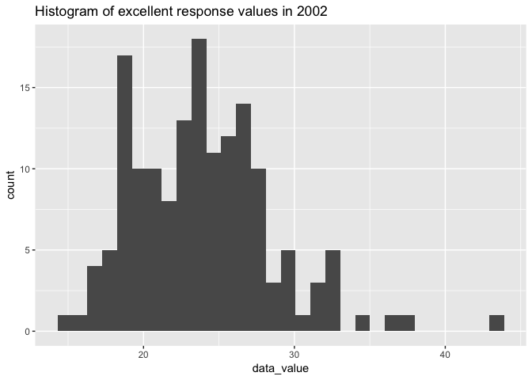
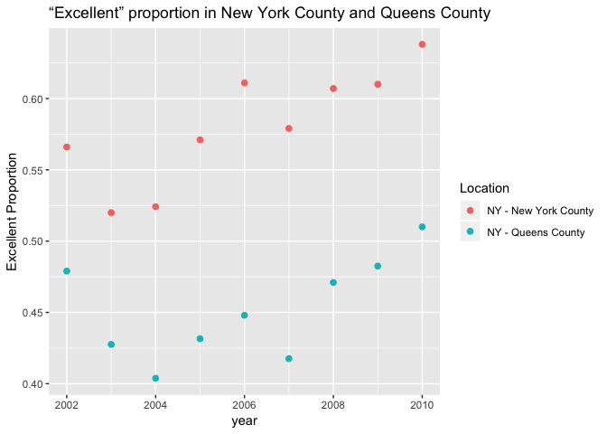

P8105\_hw\_yx2510
================
Yi Xiao
28/09/2018

load package

``` r
library(tidyverse)
```

    ## ── Attaching packages ──────────────────────────────────────────────────────────────────────────────── tidyverse 1.2.1 ──

    ## ✔ ggplot2 3.0.0     ✔ purrr   0.2.5
    ## ✔ tibble  1.4.2     ✔ dplyr   0.7.6
    ## ✔ tidyr   0.8.1     ✔ stringr 1.3.1
    ## ✔ readr   1.1.1     ✔ forcats 0.3.0

    ## ── Conflicts ─────────────────────────────────────────────────────────────────────────────────── tidyverse_conflicts() ──
    ## ✖ dplyr::filter() masks stats::filter()
    ## ✖ dplyr::lag()    masks stats::lag()

``` r
library(readxl)
library(magrittr)
```

    ## 
    ## Attaching package: 'magrittr'

    ## The following object is masked from 'package:purrr':
    ## 
    ##     set_names

    ## The following object is masked from 'package:tidyr':
    ## 
    ##     extract

Problem 1
=========

### 1. read and clean the data

``` r
nyc_transit_data =
        read_csv("./data/NYC_Transit_Subway_Entrance_And_Exit_Data.csv") %>%
        janitor::clean_names() %>%
        select(line:entry,vending, ada)%>%
        mutate(entry = recode(entry, "YES" = TRUE, "NO" = FALSE))
```

    ## Parsed with column specification:
    ## cols(
    ##   .default = col_character(),
    ##   `Station Latitude` = col_double(),
    ##   `Station Longitude` = col_double(),
    ##   Route8 = col_integer(),
    ##   Route9 = col_integer(),
    ##   Route10 = col_integer(),
    ##   Route11 = col_integer(),
    ##   ADA = col_logical(),
    ##   `Free Crossover` = col_logical(),
    ##   `Entrance Latitude` = col_double(),
    ##   `Entrance Longitude` = col_double()
    ## )

    ## See spec(...) for full column specifications.

``` r
str(nyc_transit_data)
```

    ## Classes 'tbl_df', 'tbl' and 'data.frame':    1868 obs. of  19 variables:
    ##  $ line             : chr  "4 Avenue" "4 Avenue" "4 Avenue" "4 Avenue" ...
    ##  $ station_name     : chr  "25th St" "25th St" "36th St" "36th St" ...
    ##  $ station_latitude : num  40.7 40.7 40.7 40.7 40.7 ...
    ##  $ station_longitude: num  -74 -74 -74 -74 -74 ...
    ##  $ route1           : chr  "R" "R" "N" "N" ...
    ##  $ route2           : chr  NA NA "R" "R" ...
    ##  $ route3           : chr  NA NA NA NA ...
    ##  $ route4           : chr  NA NA NA NA ...
    ##  $ route5           : chr  NA NA NA NA ...
    ##  $ route6           : chr  NA NA NA NA ...
    ##  $ route7           : chr  NA NA NA NA ...
    ##  $ route8           : int  NA NA NA NA NA NA NA NA NA NA ...
    ##  $ route9           : int  NA NA NA NA NA NA NA NA NA NA ...
    ##  $ route10          : int  NA NA NA NA NA NA NA NA NA NA ...
    ##  $ route11          : int  NA NA NA NA NA NA NA NA NA NA ...
    ##  $ entrance_type    : chr  "Stair" "Stair" "Stair" "Stair" ...
    ##  $ entry            : logi  TRUE TRUE TRUE TRUE TRUE TRUE ...
    ##  $ vending          : chr  "YES" "YES" "YES" "YES" ...
    ##  $ ada              : logi  FALSE FALSE FALSE FALSE FALSE FALSE ...

After importing the file using read\_csv() function, I found that there are upper cases and spaces in the variable names, so I first use the clean\_name() for the name cleaning. Then I used the select() function to include those variables we are interested in. At last, recode() was used to convert the entry status to corresponding logical variables.

Some important variables includes line, station name, latitide and longitude of their locations, routes they take, entry type, whether vending and entry are ADA compliant. There were *19* columns and *1868* rows. However, the dataset is not tidy since the route information was scattered across several colunms. Hence, data cleaning is required to gather the information in a single column.

-   There are *465* staions in the data.

-   There are *84* ADA compliant stations.

-   There are 9.8% of exit/entry witout pending allow entry.

### 2. data tidying

In this code chunk, I reformated data so that route number and route name are distinct variables.

``` r
nyc_transit_tidy_data = gather(nyc_transit_data, key = route, value = route_number, route1: route11)
str(nyc_transit_tidy_data)
```

    ## Classes 'tbl_df', 'tbl' and 'data.frame':    20548 obs. of  10 variables:
    ##  $ line             : chr  "4 Avenue" "4 Avenue" "4 Avenue" "4 Avenue" ...
    ##  $ station_name     : chr  "25th St" "25th St" "36th St" "36th St" ...
    ##  $ station_latitude : num  40.7 40.7 40.7 40.7 40.7 ...
    ##  $ station_longitude: num  -74 -74 -74 -74 -74 ...
    ##  $ entrance_type    : chr  "Stair" "Stair" "Stair" "Stair" ...
    ##  $ entry            : logi  TRUE TRUE TRUE TRUE TRUE TRUE ...
    ##  $ vending          : chr  "YES" "YES" "YES" "YES" ...
    ##  $ ada              : logi  FALSE FALSE FALSE FALSE FALSE FALSE ...
    ##  $ route            : chr  "route1" "route1" "route1" "route1" ...
    ##  $ route_number     : chr  "R" "R" "N" "N" ...

-   There are 60 distinct stations serve A.

-   Of the stations serve A train, there are 17 ADA compliant stations.

Problem 2
=========

### 1. read and clean Mr Trash wheel data

``` r
 trash_wheel_data = readxl::read_xlsx("./data/HealthyHarborWaterWheelTotals2017-9-26.xlsx", 
                     sheet = "Mr. Trash Wheel", 
                     range = "A2:N258")  %>%
                     janitor::clean_names()  %>%
                     filter(!is.na(dumpster))  %>%
                     mutate(sports_balls = round(sports_balls, digits = 0)) %>% 
                     mutate(sports_balls = as.integer(sports_balls))
str(trash_wheel_data)
```

    ## Classes 'tbl_df', 'tbl' and 'data.frame':    215 obs. of  14 variables:
    ##  $ dumpster          : num  1 2 3 4 5 6 7 8 9 10 ...
    ##  $ month             : chr  "May" "May" "May" "May" ...
    ##  $ year              : num  2014 2014 2014 2014 2014 ...
    ##  $ date              : POSIXct, format: "2014-05-16" "2014-05-16" ...
    ##  $ weight_tons       : num  4.31 2.74 3.45 3.1 4.06 2.71 1.91 3.7 2.52 3.76 ...
    ##  $ volume_cubic_yards: num  18 13 15 15 18 13 8 16 14 18 ...
    ##  $ plastic_bottles   : num  1450 1120 2450 2380 980 1430 910 3580 2400 1340 ...
    ##  $ polystyrene       : num  1820 1030 3100 2730 870 2140 1090 4310 2790 1730 ...
    ##  $ cigarette_butts   : num  126000 91000 105000 100000 120000 90000 56000 112000 98000 130000 ...
    ##  $ glass_bottles     : num  72 42 50 52 72 46 32 58 49 75 ...
    ##  $ grocery_bags      : num  584 496 1080 896 368 ...
    ##  $ chip_bags         : num  1162 874 2032 1971 753 ...
    ##  $ sports_balls      : int  7 5 6 6 7 5 3 6 6 7 ...
    ##  $ homes_powered     : num  0 0 0 0 0 0 0 0 0 0 ...

### 2. read and clean 2016 and 2017 precipitation data

``` r
prcp_16_data =
  readxl::read_xlsx("./data/HealthyHarborWaterWheelTotals2017-9-26.xlsx", 
             sheet = "2016 Precipitation", 
             range = "A2:B14") %>%
  janitor::clean_names() %>%
  filter(!is.na(total)) %>% 
  mutate(year = 2016)

prcp_17_data =
  readxl::read_xlsx("./data/HealthyHarborWaterWheelTotals2017-9-26.xlsx", 
             sheet = "2017 Precipitation", 
             range = "A2:B14") %>%
  janitor::clean_names() %>%
  filter(!is.na(total)) %>% 
  mutate(year = 2017)
```

### 3. combine the data

``` r
prcp_16_data = mutate(prcp_16_data, month = month.name)
prcp_17_data = mutate(prcp_17_data, month = month.name[month])
prcp_comb = full_join(prcp_16_data, prcp_17_data)
```

    ## Joining, by = c("month", "total", "year")

``` r
str(prcp_comb)
```

    ## Classes 'tbl_df', 'tbl' and 'data.frame':    20 obs. of  3 variables:
    ##  $ month: chr  "January" "February" "March" "April" ...
    ##  $ total: num  3.23 5.32 2.24 1.78 5.19 3.2 6.09 3.96 4.53 0.62 ...
    ##  $ year : num  2016 2016 2016 2016 2016 ...

This dataset has 215 observations including 14 variables such as dumpster, month, year, date, weight\_tons and number of all types of trash collected by Mr Trash Wheel in Baltimore from 2014 to 2017. There are 20 observations included in the combined date prcp\_comb, which recorded the precipitation infomation.

Problem 3
=========

### 1. load and clean the data

``` r
library(p8105.datasets)
brfss_data = p8105.datasets::brfss_smart2010 %>% 
                janitor::clean_names() %>%
                rename(state = locationabbr, state_county = locationdesc) %>%
                filter(topic == "Overall Health") %>%
                select(-(class:question),
                       -(sample_size),
                       -(confidence_limit_low:geo_location))

brfss_prop_data <- brfss_data %>%
  spread(key = response, value = data_value) %>% 
  janitor::clean_names() %>%
  mutate(proportion =  
           (excellent + very_good) / (excellent + very_good + good +fair + poor))
```

### 2. answer the question

``` r
all_state = (nrow(distinct(brfss_prop_data, state))) == 51

max_state = count(brfss_prop_data, state) %>%
filter(n == max(n))
```

-   404 of unique locations are included in the dataset. The answer to whether all of the states are presented is TRUE. The state with the most record is NJ (146 observations).

``` r
excel_2002 = brfss_data %>%
filter(response == "Excellent" & year == "2002" & !is.na(data_value))
```

-   The median of the excellent response value is 23.6.

### make plots

-   Make a histogram of “Excellent” response values in the year 2002.

``` r
ggplot(excel_2002, aes(x = data_value)) + 
  geom_histogram() +
  ggtitle("Histogram of excellent response values in 2002")
```

    ## `stat_bin()` using `bins = 30`. Pick better value with `binwidth`.



-   Make a scatterplot showing the proportion of “Excellent” response values in New York County and Queens County (both in NY State) in each year from 2002 to 2010.

``` r
ny_queen_excel = filter(brfss_prop_data, state_county %in% c("NY - New York County", "NY - Queens County") 
                        & year %in% c(2002:2010))
                        
ggplot(ny_queen_excel, aes(x = year, y = proportion, color = state_county)) +
        ggtitle("“Excellent” proportion in New York County and Queens County") +
        geom_point(size = 2) +
        scale_color_discrete(name = "Location") +
        labs(y = "Excellent Proportion")
```


